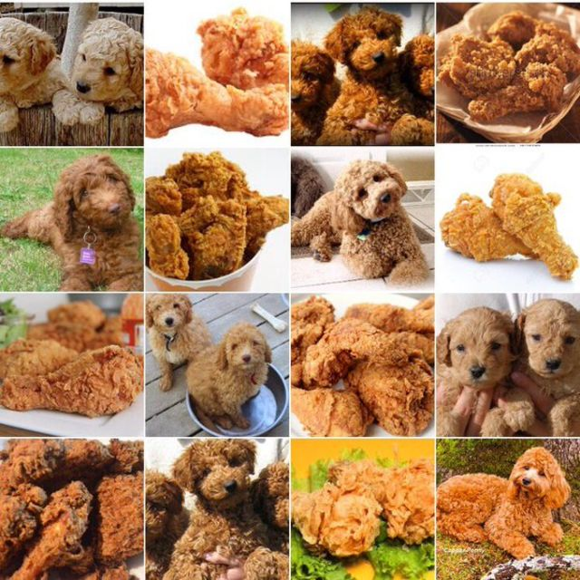

# Project: Dogs, Fried Chicken or Blueberry Muffins?



### [Full Project Description](doc/project3_desc.md)

Term: Spring 2018

+ Team 8
+ Team members
	+ 1 Dong, Jiaqi jd3418@columbia.edu
	+ 2 Fan, Xiaochen xf2170@columbia.edu 
	+ 3 Li, Hongyu hl3099@columbia.edu
	+ 4 Zheng, Jia jz2891@columbia.edu

+ Project summary:    
  
In this project, we created a classification engine for images of Dogs, images of Fried Chicken and images of Blueberry Muffins. We set our baseline model using SIFT features and gradient boosting machine(GBM) classifier. Besides the SIFT features, we also used HOG, RGB SURF and ORB to do feature selection. We also performed PCA, TSNE, LLE and ISOMAP on the feature data to reduce dimension and trained model with feature data after processing.In terms of classifiers, we considered SVM, Random Forest, XGBoost and GBM. After model evaluation and comparison, the final advanced model we selected is using RGB feature and XGBoost classifier. 

+ Outcome Analysis  
  


     
 Summary for model performance are shown in detail in [summary](output/summary.html), we can see that XGboost+RGB has similar accuracy as RF+RGB but it takes less time.

 	
**Contribution statement**:

+ Dong, Jiaqi
             
	+ Generate README.md
	+ Train and test Random Forest model based on SIFT, HOG, RGB and ORB 
	+ Pick the best parameter of Random Forest model, test using cross validation
         
+ Fan, Xiaochen          

	+ Make the PPT and give the presentation
	
+ Li, Hongyu 	

	+ Built baseline model(GBM with SIFT).
	
	+ Built RGB and HoG feature extraction function.

	+ Trained GBM based on SIFT, RGB, HoG, ORB and SURF.
	
	+ Trained Xgboost based on SIFT, RGB, HoG, ORB and SURF.
	
	+ Performed PCA, TSNE, LLE and ISOMAP on the feature data to reduce dimension 
        and trained model with feature data after processing.
        
        + Completed main.rmd, feature.R, train.R, test.R and cross_validation.R.
	
+ Zheng, Jia 
        
	+ Applied rbf-kernel SVM model to classification problem. 
	
	+ Constructed feature data for each image using bag-of-words strategy after SIFT, SURF, ORB, RGB, HOG feature extraction and mini-batch kmeans clustering. 
	
	+ Conducted cross validation of C and gamma parameters and trained model using selected tuning parameters. 
	
	+ Tested model in seperate five cases and summarized the time cost and error using bar plot.


Following [suggestions](http://nicercode.github.io/blog/2013-04-05-projects/) by [RICH FITZJOHN](http://nicercode.github.io/about/#Team) (@richfitz). This folder is orgarnized as follows.

```
proj/
├── lib/
├── data/
├── doc/
├── figs/
└── output/
```

Please see each subfolder for a README file.
